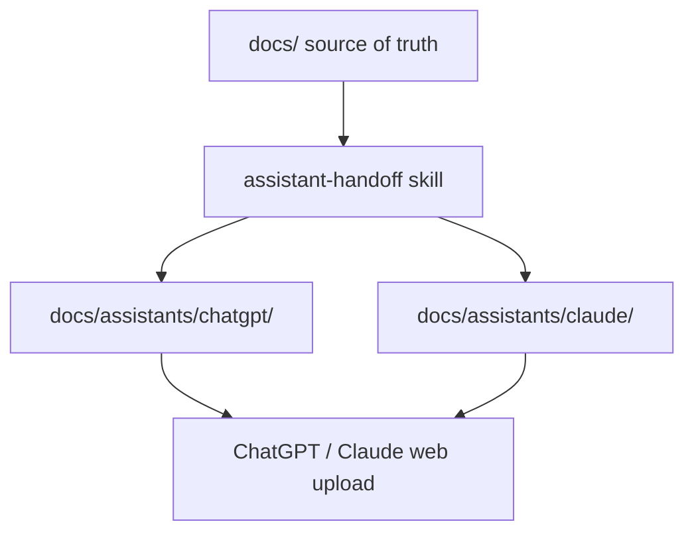

# Plan: External Assistant Handoff Packs

| Field | Value |
|-------|-------|
| Date | 2026-07-09 |
| Author | Planning Agent |
| Status | ready_for_review |
| Workflow | managed-phase |
| Phase | `external-assistant-handoff-packs` |
| Related | docs/freshforge-development/reviews/external-assistant-handoff-packs-review.md |

---

## Goal

Ship FreshForge with a **default, discoverable, non-cluttered** place for portable AI handoff docs so users can upload a pack once to ChatGPT or Claude (web), then re-upload mainly `CURRENT-STATE.md` as the project changes—while `docs/` remains the agent source of truth.

## Background

Reference implementation: `reference/chatgpt/` (ViewMyCOA). That pack includes overview, architecture, living current-state, and copy-paste instructions for an external ChatGPT project. Users want the same pattern for Claude web, without polluting the project root.

## Decisions (locked)

| Decision | Choice |
|----------|--------|
| Location | `docs/assistants/chatgpt/` and `docs/assistants/claude/` |
| Ship depth | **Templates + skill** (not empty stubs only; not auto-hooks yet) |
| Source of truth | Permanent docs under `docs/project/`, `docs/architecture/`, etc. |
| Portable export | Assistant packs are derived snapshots for external tools |
| Root pollution | No new top-level folders |

## Reference model

Each pack includes:

| File | Role | Update cadence |
|------|------|----------------|
| `README.md` | How to use the pack | Rarely |
| `INSTRUCTIONS.md` | Copy-paste Project Instructions | When process/rules change |
| `PROJECT-OVERVIEW.md` | Product / users / features | Behavior/feature changes |
| `ARCHITECTURE-AND-CODE.md` | Stack / layout / routes / data | Structure/API/schema changes |
| `CURRENT-STATE.md` | Living snapshot | Every implement / test / signoff |

Starter templates ship with placeholders (`[PROJECT_NAME]`, `[TBD]`)—not ViewMyCOA content. `reference/chatgpt/` stays a **dev-only example** (not installed).

## Scope

### In Scope

1. **Folder layout (starter surface)**
   - `docs/assistants/README.md` — index: what this is, where ChatGPT vs Claude packs live
   - `docs/assistants/chatgpt/` — full template set (5 files)
   - `docs/assistants/claude/` — same structure; Claude-oriented `INSTRUCTIONS.md` / README wording

2. **Skill** `.cursor/skills/assistant-handoff/SKILL.md`
   - Create or refresh packs from `docs/` + `.cursor/workflow/state.md`
   - Aliases: `Assistant Handoff`, `Update Assistants`, `Refresh CURRENT-STATE`
   - Modes: create both packs | update one | refresh `CURRENT-STATE.md` only
   - Never invent product facts; mark `[INFERRED]` / `[NEEDS HUMAN INPUT]`
   - Always refresh CURRENT-STATE on managed-phase signoff triggers

3. **Wire into existing workflow**
   - Extend `documentation-update` skill and `documentation.mdc`: after behavior/architecture changes and at signoff, update assistant packs (at least CURRENT-STATE)
   - Brief mentions in intake/bootstrap/signoff skills
   - Command aliases in `.cursor/workflow/command-aliases.md`

4. **Discoverability**
   - Short section in `AGENTS.md`: External AI packs → `docs/assistants/`
   - Pointers in `docs/AI_RULES.md` / `docs/WORKFLOWS.md`
   - Update STARTER_SURFACE / INSTALLATION / DISTRIBUTION as needed

5. **Validation**
   - Require `docs/assistants/` templates in structure validation
   - Ensure packs are included in default export (under `docs/`)
   - Exclude `reference/` from install/export if not already

6. **Migration**
   - Doctor note if assistants folder missing on older installs
   - Migration `add-assistant-handoff-packs` to sync templates
   - **Never overwrite** populated PROJECT-OVERVIEW / ARCHITECTURE / CURRENT-STATE with blank templates

### Out of Scope

- Auto-updating CURRENT-STATE via Cursor hooks on every state.md write
- Installing `reference/` into target projects
- Root-level `chatgpt/` or `assistants/` folders
- Making assistant packs replace `docs/` for Cursor/Codex/Claude Code agents
- Generating packs from app source without reading `docs/` first

---

## Affected Areas

### Files / Modules (expected)

**New:**
- `docs/assistants/README.md`
- `docs/assistants/chatgpt/{README,INSTRUCTIONS,PROJECT-OVERVIEW,ARCHITECTURE-AND-CODE,CURRENT-STATE}.md`
- `docs/assistants/claude/{same}`
- `.cursor/skills/assistant-handoff/SKILL.md`
- `docs/freshforge-development/migrations/add-assistant-handoff-packs.md` (if migration added)

**Modified:**
- `.cursor/skills/documentation-update/SKILL.md`
- `.cursor/rules/documentation.mdc`
- `.cursor/workflow/command-aliases.md`
- Intake/bootstrap/signoff skills (brief)
- `AGENTS.md`, `docs/AI_RULES.md`, `docs/WORKFLOWS.md`
- `scripts/validate-structure.mjs`, possibly `freshforge-migrations.mjs` / `run-doctor.mjs`
- Distribution docs under `docs/freshforge-development/distribution/`
- `docs/project/DECISIONS.md` (ADR)

### Architecture Impact

- [x] Details: New docs subtree for portable exports; no app architecture change

### Security Impact

- [x] Details: Handoff packs must not include secrets; templates warn against uploading `.env` / keys

### Data Model / Backend / UI Impact

- [x] None

### Migration Impact

- [x] Forward: add `docs/assistants/` templates via migrate if missing
- [x] Rollback: remove folder or restore from `.freshforge/backups/`

---

## Approach

1. Create `docs/assistants/` index + chatgpt/claude template packs from reference structure (generic placeholders).
2. Add `assistant-handoff` skill with create/refresh/CURRENT-STATE-only modes.
3. Wire documentation-update + documentation.mdc + command aliases + AGENTS discoverability.
4. Validation: required files; export includes assistants; `reference/` excluded.
5. Migration + doctor for older installs; never blank-overwrite filled packs.
6. Export, validate, archive workflow artifacts under `docs/freshforge-development/`.

---

## Test Strategy

### Automated

| Check | Command | Required |
|-------|---------|----------|
| Export | `npm run export:starter -- --clean` | yes |
| Validate | `npm run validate` | yes |
| Doctor | `node bin/freshforge.mjs doctor --target ./dist/freshforge-starter` | yes |
| Migrations | `npm run validate:migrations` | yes if migration added |

### Manual

- Confirm exported starter has `docs/assistants/chatgpt/` and `docs/assistants/claude/` with all 5 files each
- Confirm `reference/` not in export
- Confirm AGENTS.md points to `docs/assistants/`

---

## Human Checkpoints Anticipated

- [x] None for shipping templates/skill

---

## Risks & Mitigations

| Risk | Severity | Mitigation |
|------|----------|------------|
| Drift between docs/ and assistants/ | medium | Skill + documentation-update + signoff checklist |
| Overwriting filled packs on migrate | high | Never replace meaningful content with blank templates |
| Users confuse packs with agent source of truth | low | README + AGENTS.md: portable export; docs/ is truth |

---

## Rollback Plan

Revert starter files via git; migrated targets restore from `.freshforge/backups/`.

---

## Documentation Updates Required

- [x] STARTER_SURFACE, INSTALLATION, DISTRIBUTION, PACKAGING
- [x] AGENTS.md, AI_RULES.md, WORKFLOWS.md
- [x] DECISIONS.md (ADR)
- [x] migrations README if migration added

---

## Open Questions

- [x] None — location and ship depth locked

---

## Approval

- Review doc: pending
- Verdict: pending
